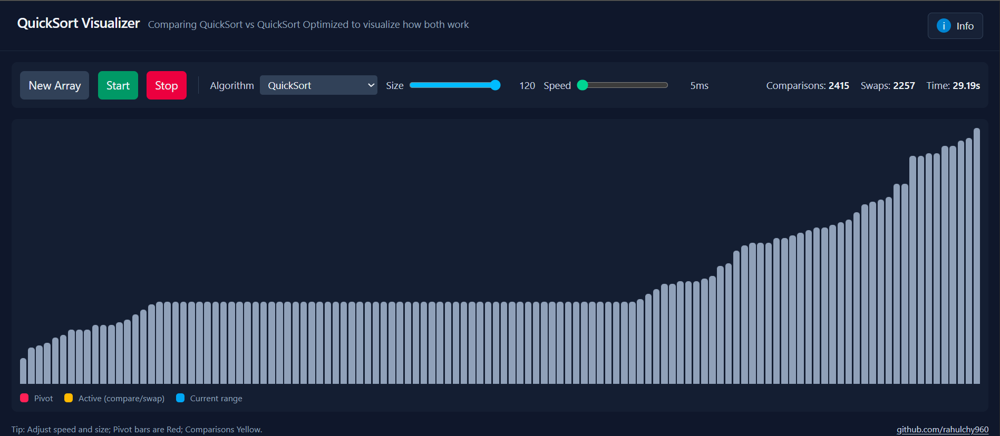
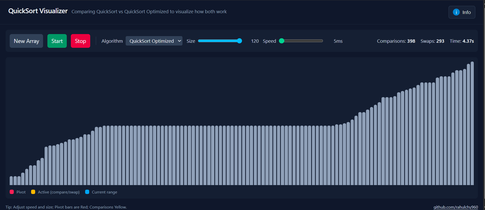

## Live Demo

- App Repo: https://github.com/rahulchy960/sorting-visualizer
- Try it here: https://sorting-visualizer-three-rust.vercel.app/

## Algorithms

### Basic QuickSort (Lomuto)
- Uses the Lomuto partition scheme (pivot = last element)
- Straightforward recursive implementation
- Worst-case `O(n^2)` on pre-sorted or adversarial inputs

### Optimized QuickSort
- Leverages 3-way partitioning (Dutch National Flag) to cluster duplicates
- Applies tail recursion elimination to minimize stack usage
- Achieves better performance on inputs with repeated values

## Why 3-Way QuickSort?

The standard QuickSort typically picks the first or last element as the pivot, partitions around it, and recurses on both halves. While effective on random data, it struggles when the array contains many duplicates: equal values get split across subproblems, driving the complexity toward `O(n^2)`.

The optimized variant used here splits the array into three regions in a single pass: less than, equal to, and greater than the pivot. The middle section (equal elements) no longer needs further work, which means:

- Arrays filled with a single value finish in linear time `O(n)`.
- Inputs with heavy duplication avoid unnecessary comparisons (often up to 80% fewer).
- Combined with tail call elimination and always recursing on the smaller partition, the stack stays shallow and memory overhead drops.

In short, 3-way QuickSort keeps the elegant performance of classic QuickSort on random data while patching its biggest weakness: duplicates.

## Screenshots

